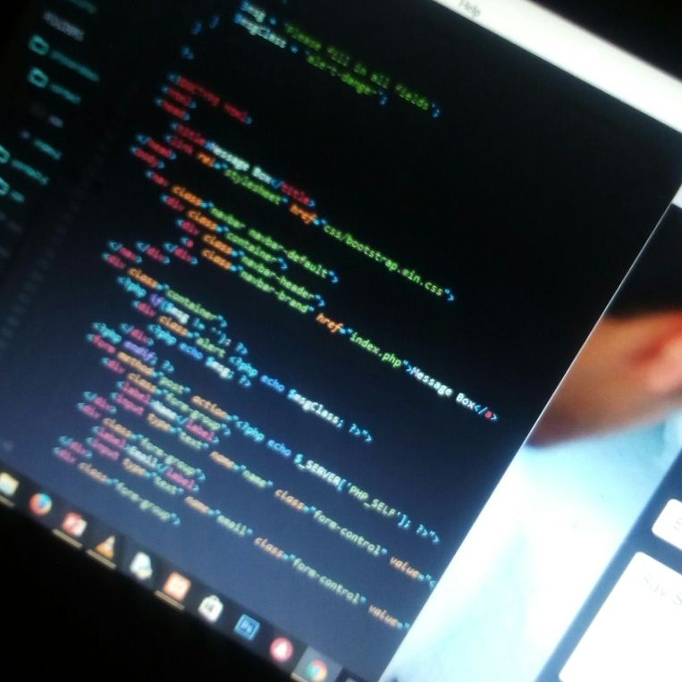
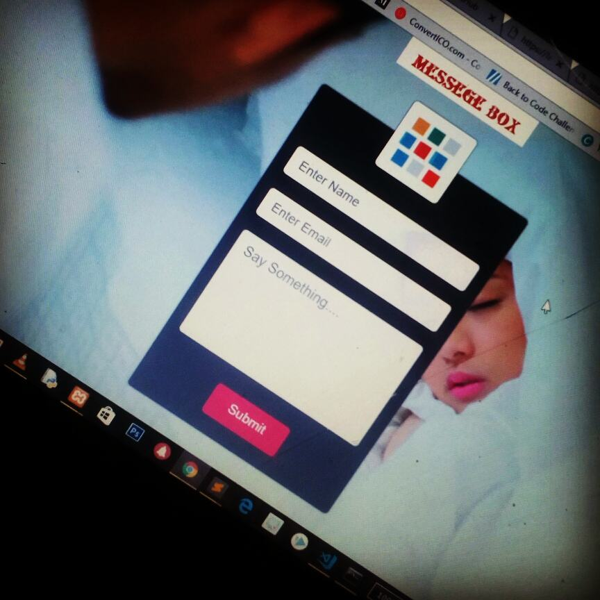
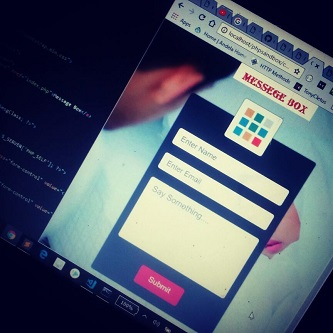

# message-box
A SIMPLE AND NEAT CONTACT US BOX OR A MESSAGE BOX.....

<h3>SETUP STEPS</h3>
<ul>
  <ol>Clone or Download The Project.</ol>
  <ol>Start your server... (XAMMP or WAMMP) Recommended for development purposes</ol>
  <ol>localhost/project folder/index.php 
    
Note: Message sending via offline server won't be successful. 
    It has to be deployed to the internet and live before mail function works. (Strictly for those using XAMMP or WAMMP)

  </ol>
</ul>

<h3>DEMO PICUTES</h3>
<ul>
  <li></li>
  <li></li>
  <li></li>
</ul>
